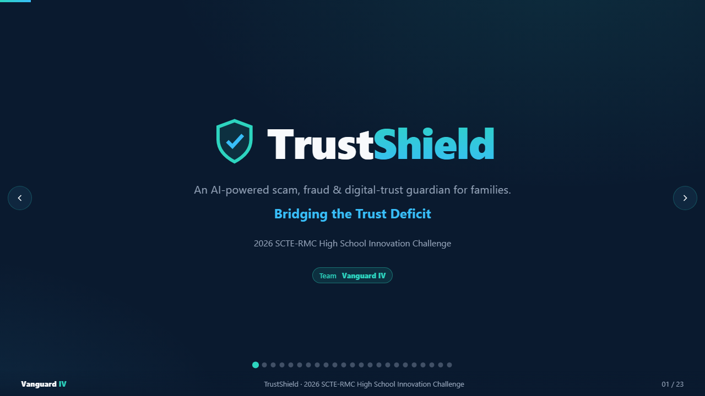
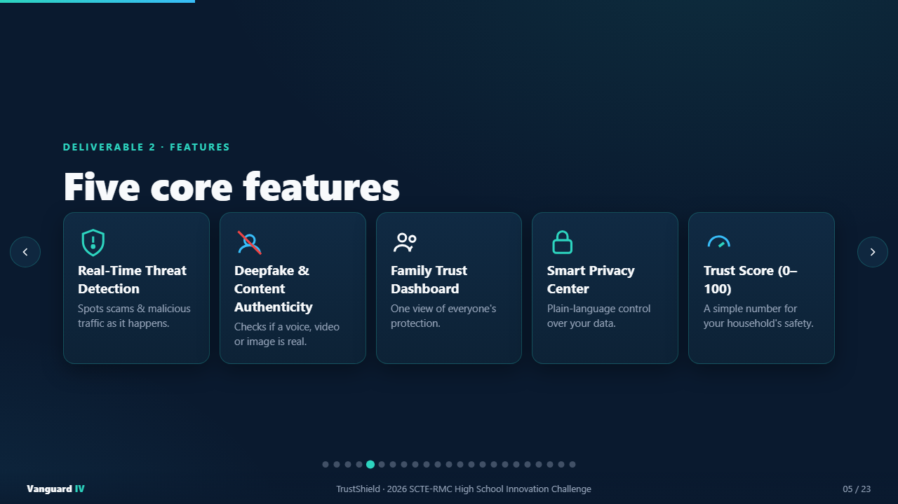
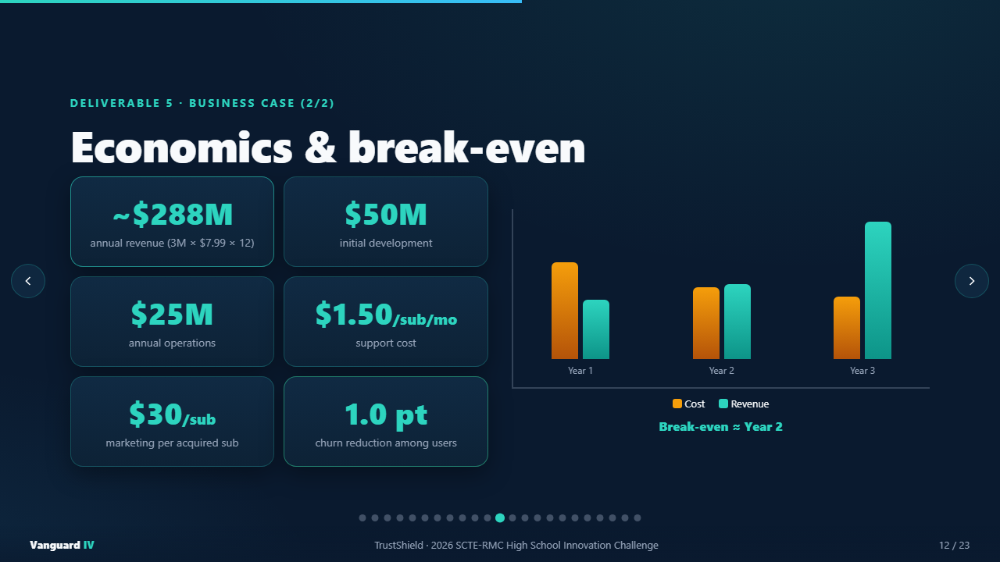
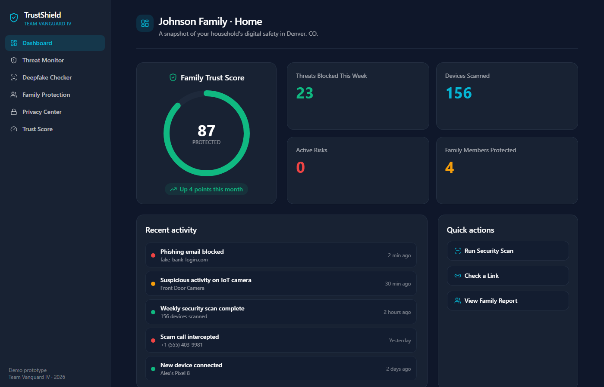
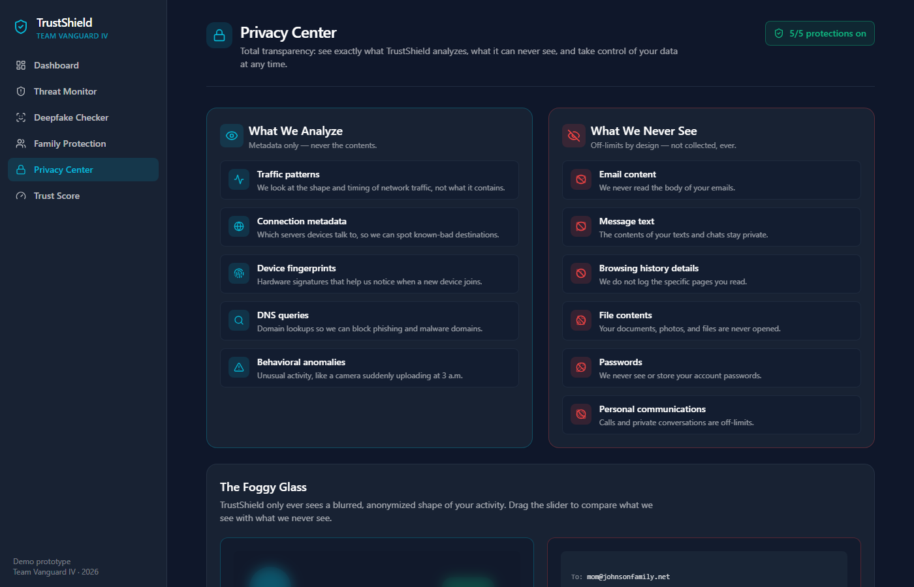
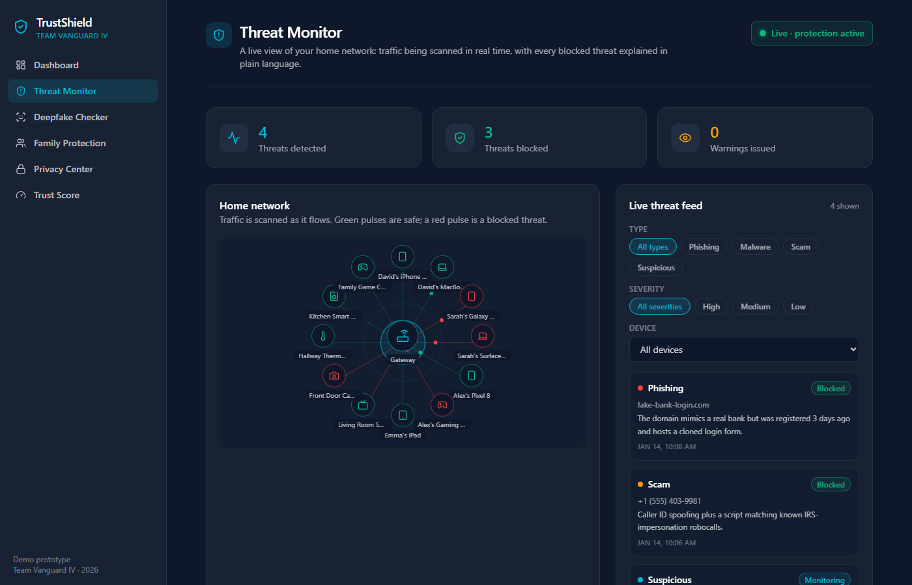
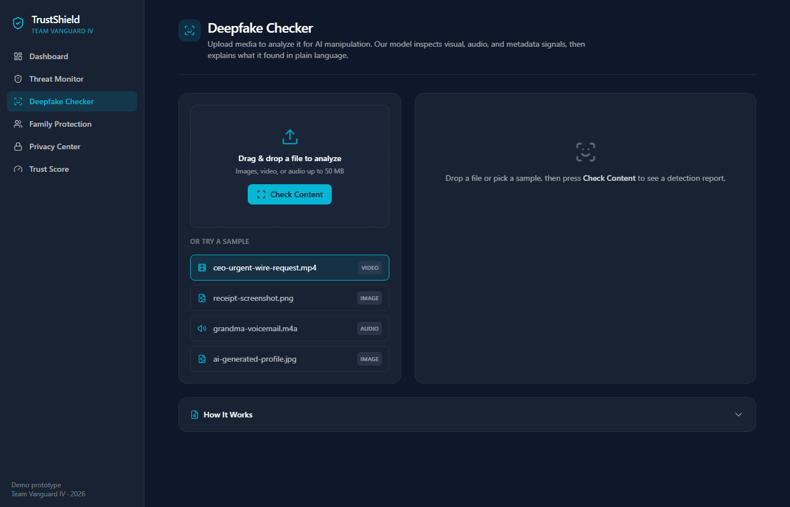
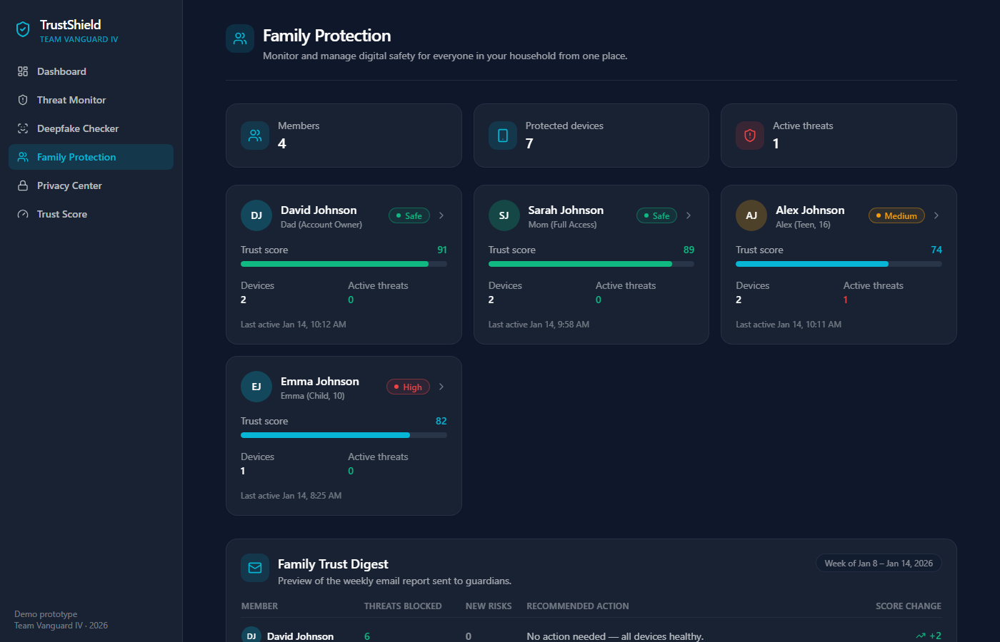
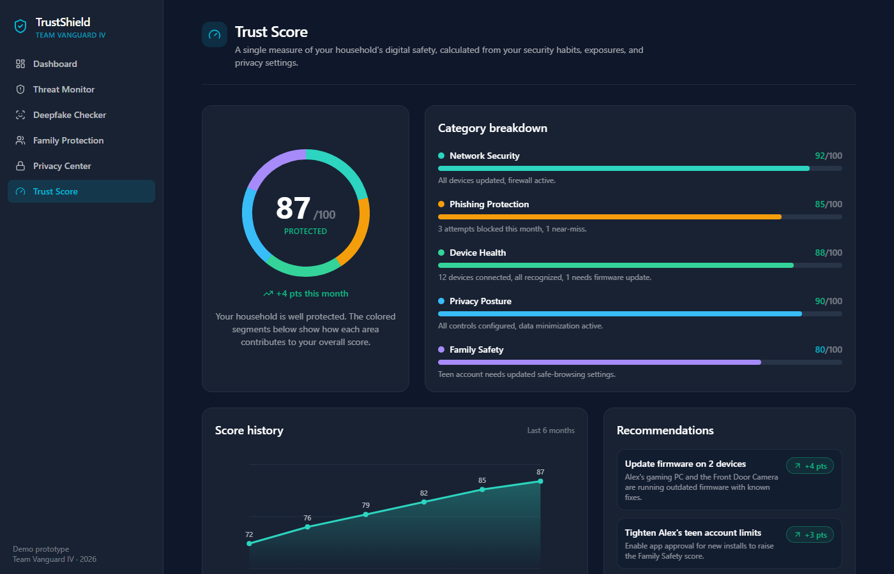

# 🛡️ Vanguard IV — TrustShield

**2026 SCTE-RMC High School Innovation Challenge**
*Bridging the Trust Deficit: Designing Technologies That Restore Confidence in a Connected World*

---

## 👋 Welcome, Vanguard IV!

This is your starting point for the Innovation Challenge. Inside this repo you'll find two things your team built:

1. **A working web app prototype** — a clickable demo of TrustShield with 6 interactive screens
2. **A presentation** — a 23-slide HTML deck covering all 10 required deliverables

Both are meant as a **foundation for you to build on**. Make them your own — change things, add ideas, break stuff and fix it. That's how you learn.

---

## 🖥️ What TrustShield Is

**TrustShield** is a concept for an AI-powered scam, fraud, and digital-trust guardian for families. It would be delivered through a broadband provider (like Spectrum, Comcast, etc.) using the Wi-Fi gateway that's already in your home.

Instead of making people juggle five different security apps, TrustShield combines threat detection, deepfake checking, family protection, and privacy controls into one dashboard — and sums it all up as a single **Trust Score**.

### The "Foggy Glass" Privacy Model
This is the key idea that makes TrustShield different: it analyzes network *patterns and shapes* — **never your actual content**. Think of looking through a frosted bathroom window — you can see if someone is there, but you can't read what's on their phone. That's how TrustShield works.

---

## 📸 What It Looks Like

### The Presentation
Open `presentation.html` in any browser. Use arrow keys or click to navigate.







### The Prototype App
A real interactive web app with 6 screens.













---

## 🚀 How to Run Everything

### The Presentation (Easy — No Install Needed)

1. Find the file `presentation.html` in this repo
2. Double-click it (or right-click → Open With → Chrome/Edge)
3. Use **arrow keys** (← →) or **click** the left/right edges to move between slides
4. That's it!

To edit the presentation, just open `presentation.html` in any text editor (VS Code, Notepad, etc.) and change the text you see. It's all in one file.

### The Prototype App

This requires a few things installed first. Follow these steps carefully:

#### Step 1: Install Node.js
1. Go to [https://nodejs.org](https://nodejs.org)
2. Download the **LTS** version (the big green button)
3. Run the installer — just click Next through everything, use all the defaults
4. When it's done, **restart your computer** (this makes sure the commands work)

#### Step 2: Install Git (if you don't have it)
1. Go to [https://git-scm.com/downloads](https://git-scm.com/downloads)
2. Download and install for your OS
3. Use all the default settings

#### Step 3: Get the Code
Open a terminal (search for "Terminal" or "Command Prompt" or "PowerShell" on your computer) and type:
```bash
git clone https://github.com/cbytes1/VanguardIV.git
cd VanguardIV/trustshield-prototype
```

#### Step 4: Install Dependencies and Run
```bash
npm install
npm run dev
```

#### Step 5: Open It
Open your browser and go to: **http://localhost:3000**

You should see the TrustShield landing page. Click "Start the tour" or use the sidebar to explore all 6 screens.

> **Tip:** Keep the terminal open while you're using the app. To stop it, press `Ctrl + C` in the terminal.

### The 6 Screens
| Screen | URL | What It Shows |
|---|---|---|
| Landing Page | `/` | Welcome page with overview |
| Dashboard | `/dashboard` | Trust Score, threat stats, recent activity |
| Threat Monitor | `/threat-monitor` | Live network map with threat detection |
| Deepfake Checker | `/deepfake-checker` | Check if content is AI-generated |
| Family Protection | `/family-protection` | Per-family-member controls and alerts |
| Privacy Center | `/privacy-center` | The "foggy glass" model + data controls |
| Trust Score | `/trust-score` | Score breakdown, history, recommendations |

---

## ✏️ How to Edit and Customize

### Editing the Presentation
- Open `presentation.html` in VS Code or any text editor
- Search for the text you want to change and edit it directly
- Save and refresh your browser to see changes
- Each slide is a `<section>` block — you can find them by searching for `SLIDE 1`, `SLIDE 2`, etc.

### Editing the Prototype
The prototype code is in the `trustshield-prototype/` folder. Here's what's where:

```
trustshield-prototype/
├── app/                        ← The 6 screens live here
│   ├── dashboard/              ← Dashboard screen
│   ├── threat-monitor/         ← Threat Monitor screen
│   ├── deepfake-checker/       ← Deepfake Checker screen
│   ├── family-protection/      ← Family Protection screen
│   ├── privacy-center/         ← Privacy Center screen
│   ├── trust-score/            ← Trust Score screen
│   ├── page.tsx                ← Landing page
│   ├── layout.tsx              ← Shared layout (wraps every page)
│   └── globals.css             ← Global styles
├── components/                 ← Reusable UI pieces (sidebar, cards, gauges)
├── data/mock.ts                ← ALL the fake data (family, devices, threats)
├── lib/types.ts                ← TypeScript type definitions
└── lib/utils.ts                ← Helper functions
```

**Easiest things to change first:**
- **`data/mock.ts`** — Change the family name, add devices, change threat data, update the Trust Score
- **`app/*/page.tsx`** — Change headings, descriptions, and labels on each screen
- **`app/globals.css`** — Change colors, fonts, spacing
- **`components/Sidebar.tsx`** — Change the sidebar navigation

After making changes, save the file and your browser should automatically refresh (if you're running `npm run dev`).

---

## 🛠️ Free Tools to Help You Build

You don't need to be an expert coder to improve this project. These free AI tools can help you make changes, fix bugs, and add new features just by describing what you want in plain English.

### AI Coding Assistants (Free)

| Tool | What It Does | How to Get It |
|---|---|---|
| **[Google Antigravity](https://antigravity.dev)** | Google's AI app builder — describe what you want and it builds it. Great for iterating on the prototype. Import the project and ask it to make changes. | Free with a Google account |
| **[Gemini](https://gemini.google.com)** | Google's AI chat — paste code, ask questions, get help debugging. Students get a free enhanced plan. | Free with a Google account |
| **[Gemini Code Assist](https://codeassist.google)** | AI coding help right inside VS Code. Autocompletes code, answers questions about your codebase, and generates code from descriptions. | Free VS Code extension |
| **[ChatGPT](https://chat.openai.com)** | OpenAI's AI chat — great for explaining code, brainstorming, and getting help with specific problems | Free tier available |
| **[Bolt.new](https://bolt.new)** | Describe an app in words and it builds it in your browser. Good for prototyping new screens or features quickly. | Free tier: 1M tokens/month |
| **[Lovable](https://lovable.dev)** | Similar to Bolt — describe what you want and it generates a working app. Has a student discount (50% off Pro). | Free tier: 30 builds/month. [Student discount](https://lovable.dev/students) |
| **[Replit](https://replit.com)** | Code editor that runs in your browser — no installs needed. Has AI built in to help you code. Good for quick experiments. | Free Starter plan |

### Code Editors (Free)

| Tool | Why Use It |
|---|---|
| **[Visual Studio Code (VS Code)](https://code.visualstudio.com)** | The most popular code editor. Free. Install the Gemini Code Assist extension for AI help built right in. |
| **[Replit](https://replit.com)** | Runs in your browser — nothing to install. Good if you can't install software on your school computer. |

### Recommended Workflow for Beginners
1. **Open the project in VS Code** with Gemini Code Assist installed
2. **Find the file you want to change** (use the folder structure above)
3. **Ask the AI for help** — highlight code, right-click, and ask Gemini to explain it or change it
4. **Or use Antigravity/Bolt.new** — paste your project files or import from GitHub and describe the changes you want in plain English
5. **Test your changes** — save, check the browser, fix any errors
6. **Commit and push** — when you're happy with changes, push them to GitHub so the whole team can see

### How to Push Your Changes to GitHub
After you make edits on your computer:
```bash
git add -A
git commit -m "Describe what you changed here"
git push
```

---

## 📊 Judging Criteria — Where We Address Each One

| Criterion | Weight | Where It Shows Up |
|---|---|---|
| **Trust-Building Impact** | 25% | Privacy Center "foggy glass" model, explainable alerts, customer control toggles, audit log |
| **Innovation & Differentiation** | 20% | Digital trust layer (not another antivirus), broadband provider advantage, network-level protection |
| **Business Viability** | 20% | Full case economics: 3M subscribers × $7.99/mo = ~$288M revenue, Year 2 break-even |
| **Technical & Operational Feasibility** | 15% | Uses existing gateway hardware, phased 3-year rollout, realistic architecture |
| **Responsible Technology Design** | 10% | 5 trust guardrails, data minimization, audit log, delete-my-data controls |
| **Presentation & Use of AI** | 10% | Transparent AI utilization section, 1+ minute of presentation time on how AI was used |

---

## 🏆 Tips for Winning

1. **Practice the demo.** Pick one person to drive the prototype during the presentation. Know exactly which screens to show and in what order. Practice at least 5 times.
2. **Own the "foggy glass" story.** When judges ask "how does the broadband provider know what I'm doing?" — your answer is that TrustShield sees *shapes*, not *content*. You designed for this from day one.
3. **Don't apologize for what the prototype doesn't do.** It's a demo. Show what it *does* demonstrate, not what's missing.
4. **The business case math matters.** Many teams skip the numbers. You have real math — use it.
5. **Talk about your AI use honestly.** The judges want to hear that you used AI thoughtfully, validated its outputs, and know where human judgment was important.
6. **Be ready for the Trust Paradox question.** A privacy group questions your service — what do you do? Your answer: you were designed for this. Foggy glass. On-device processing. Full transparency in the Privacy Center. Independent audits. This isn't a crisis — it proves the design works.

---

## ⚙️ Tech Stack
- **Next.js 15** (App Router) + **React 19** + **TypeScript** — the web framework
- **Tailwind CSS** — for styling (utility classes instead of writing custom CSS)
- **Lucide React** — for icons
- All data is **mock/simulated** — no backend, no database, no real AI. This is a demo prototype.

---

## ❓ Need Help?

- **Code not running?** Make sure Node.js is installed and you ran `npm install` first
- **Browser shows an error?** Check the terminal where you ran `npm run dev` for error messages
- **Want to change something but don't know how?** Copy the error or describe what you want into Gemini, ChatGPT, or any AI tool — they're great at explaining code
- **Broke something?** Run `git checkout .` to undo all changes and get back to the original code

---

*Built with ❤️ by Team Vanguard IV for the 2026 SCTE-RMC High School Innovation Challenge*
